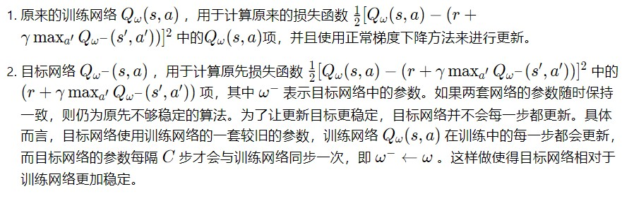

# **基于DQN算法的小车自动泊车实现**


## **一、安装依赖包**

- 下面所需要的包有**gym**、**pybullet**、**stable-baselines3**、**torch**等等。
- 借助  **requirements.txt** 文件可以直接安装。

```shell
pip install -r requirements.txt 
```


## **二、模拟环境**

* 根据实际小车地图，借助 pybullet 可视化模拟地图。
* 小车模拟环境位于 **parking_env** 下，可直接使用。

* 实际小车地图：


* 模拟小车环境：


## **三、使用DQN算法进行训练**


### **3.1 DQN算法简介**：

- 在 CartPole 环境中，若想得到动作价值函数，由于状态每一维度的值都是连续的，无法使用表格记录，因此一个常见的解决方法便是使用**函数拟合**（**function approximation**）的思想。由于神经网络具有强大的表达能力，因此我们可以用一个神经网络来表示函数。若动作是连续（无限）的，神经网络的输入是状态和动作，然后输出一个标量，表示在状态下采取动作能获得的价值。若动作是离散（有限）的，除了可以采取动作连续情况下的做法，我们还可以只将状态输入到神经网络中，使其同时输出每一个动作的值。通常 DQN（以及 Q-learning）只能处理动作离散的情况，因为在函数的更新过程中有这一操作。假设神经网络用来拟合函数的参数是 ，即每一个状态下所有可能动作的值我们都能表示为。我们将用于拟合函数函数的神经网络称为Q 网络。


- Q-learning 的**更新规则**：
  $$
  Q(s,a)\leftarrow Q(s,q)+\alpha[r+\gamma\max_{a'\in A}Q(s',a')-Q(s,a)]
  $$

- 将 Q 网络的**损失函数**构造为均方误差的形式：
  $$
  \omega^*=\arg\min_\omega\frac{1}{2N}\sum^N_{i=1}[Q_\omega(s_i,a_i)-(r_i+\gamma\max_{a'}Q_\omega(s'_i,a'_i))]^2
  $$

至此，我们就可以将 Q-learning 扩展到神经网络形式——深度 Q 网络（deep Q network，DQN）算法。由于 DQN 是离线策略算法，因此我们在收集数据的时候可以使用一个 ϵ\epsilon*ϵ* -贪婪策略来平衡探索与利用，将收集到的数据存储起来，在后续的训练中使用。


#### **3.1.1 经验回放**

在 Q-learning 算法中，每一个数据只会用来更新一次值。为了更好地将 Q-learning 和深度神经网络结合，DQN 算法采用了**经验回放**（**experience replay**）方法，具体做法为维护一个回放缓冲区，将每次从环境中采样得到的四元组数据（状态、动作、奖励、下一状态）存储到回放缓冲区中，训练 Q 网络的时候再从回放缓冲区中随机采样若干数据来进行训练。


#### **3.1.2 目标网络**




#### **3.1.3 算法流程**


### **3.2 模型训练**

- 借助 **stable-baselines3** 中已封装好的 **DQN** 函数直接进行训练。
- 在终端运行 **train.py** 文件进行训练。


在**train.py** 文件中，核心代码如下：

```python
env = gym.make("parking_env-v0", render=args.render, mode=args.mode)
env.reset()

model = DQN('MlpPolicy', env, verbose=1, seed=args.seed)
logger = configure(args.log_path, ["stdout", "csv", "tensorboard"])
model.set_logger(logger)
checkpoint_callback = CheckpointCallback(save_freq=args.save_freq, save_path=args.log_path, name_prefix='dqn_agent')
model.learn(total_timesteps=args.total_timesteps, callback=checkpoint_callback)
model.save(args.ckpt_path)
del model
```


- 训练过程展示：

1. 训练**初期**：

\

2. 训练**中期** ：


3. 训练**后期**


训练结束后，会生成相应的参数文件，可用于后续的evaluate。


## **四、泊车效果展示**

训练结束后，在 log 文件夹下会生成对应的参数文件，可进行 evaluate 以及模拟泊车渲染展示。 核心代码如下：

```python
# Evaluation
env = gym.make(args.env, render=True, mode=args.mode, render_video=True)
obs = env.reset()
model = DQN.load(args.ckpt_path, env=env)

p.configureDebugVisualizer(p.COV_ENABLE_RENDERING, 1)

p.resetDebugVisualizerCamera(
    cameraDistance=4,
    cameraYaw=cameraYaw,
    cameraPitch=-45,
    cameraTargetPosition=[0, 0, 0]
)
p.addUserDebugText(
    text=f"training step: {step}",
    textPosition=[0, 0, 2],
    textColorRGB=[1, 0, 0],
    textSize=2.5
)

log_id = p.startStateLogging(p.STATE_LOGGING_VIDEO_MP4, f"log/training/DQN_{args.mode}_{step}.mp4")
episode_return = 0
for i in range(300):
    action, _ = model.predict(obs, deterministic=True)
    obs, reward, done, info = env.step(action)
    position, _ = p.getBasePositionAndOrientation(env.car)
    episode_return += reward
    if done:
        break

p.stopStateLogging(log_id)

env.close()
print(f'step: {step}, episode return: {episode_return}')
```


模拟泊车效果：


